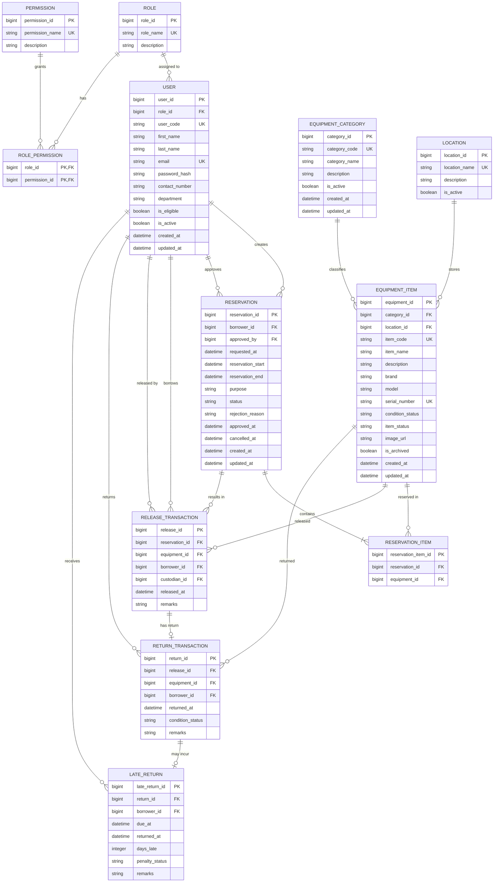
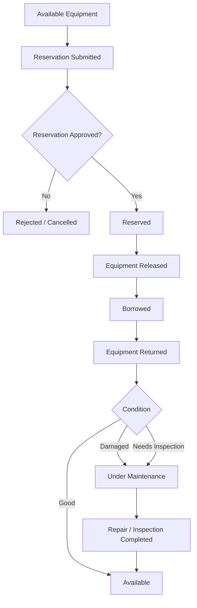

# Campus Equipment Borrowing & Reservation System
## ERD, Table Definitions, and Data Dictionary

> **Database Design Note**
>
> This design models the core business data of the Campus Equipment Borrowing & Reservation System. Authentication and password recovery are handled by **ASP.NET Core Identity**. Therefore, no custom `PASSWORD_RESET`, `OTP_CODE`, or `PASSWORD_RESET_TOKEN` table is included.
>
> The design targets **at least Third Normal Form (3NF)** by separating reusable master data, access-control data, reservation details, and borrowing transactions.

---

# 1. Entity Relationship Diagram



---

# 2. Table Definitions and Purpose

## 2.1 USER

### Purpose

Stores the application accounts and basic profile information for borrowers, custodians, and administrators.

A user has one assigned role through `role_id`.

The `user_code` represents the user's institutional identifier, such as a **student ID or faculty ID**. It is unique and can be used as an alternative login identifier together with email.

### Important Design Notes

- `user_id` is the internal primary key.
- `user_code` is a unique institutional identifier.
- `email` is also unique.
- `role_id` identifies the user's assigned role.
- `is_eligible` represents whether the borrower is currently allowed to borrow equipment.
- `is_active` controls whether the account can access the system.
- Password-reset records are not stored in a custom table because ASP.NET Core Identity handles password-reset tokens.

---

## 2.2 ROLE

### Purpose

Defines the roles available in the system.

Expected roles include:

- Borrower
- Custodian
- Administrator

A role determines the group of permissions available to a user.

---

## 2.3 PERMISSION

### Purpose

Stores individual capabilities that can be granted to roles.

Examples:

- Browse catalog and calendar
- Submit reservation request
- Approve/reject request
- Record release and return
- Maintain equipment and categories
- Maintain borrower profiles
- Manage users and roles
- View borrowing history and generate report

Permissions represent **what an account is allowed to do**, while roles represent **the account's responsibility or access group**.

---

## 2.4 ROLE_PERMISSION

### Purpose

A junction table that connects roles to permissions.

It resolves the many-to-many relationship between `ROLE` and `PERMISSION`.

For example:

```text
BORROWER
  ├── equipment.browse
  └── reservation.create

CUSTODIAN
  ├── equipment.browse
  ├── reservation.review
  ├── transaction.release_return
  └── history.view

ADMINISTRATOR
  ├── equipment.browse
  ├── reservation.review
  ├── transaction.release_return
  ├── equipment.manage
  ├── borrower.manage
  ├── user_role.manage
  └── history.view
```

The combination of `role_id` and `permission_id` should be unique.

---

## 2.5 EQUIPMENT_CATEGORY

### Purpose

Stores classifications used to group equipment.

Examples:

- Laptop
- Projector
- Camera
- Speaker
- Laboratory Tool

Categories allow equipment to be consistently classified and make searching, filtering, and reporting easier.

Categories can be deactivated rather than physically deleted so historical equipment records remain valid.

---

## 2.6 LOCATION

### Purpose

Stores the physical storage or facility location assigned to equipment.

Examples:

- Equipment Room
- Laboratory 1
- Audio-Visual Room
- IT Office

Separating locations into their own table avoids repeating location names in every equipment record.

---

## 2.7 EQUIPMENT_ITEM

### Purpose

Represents an individual physical equipment asset owned or managed by the institution.

Each physical item has its own item code and, when applicable, serial number.

The table stores information needed to identify, locate, and determine the current state of an item.

Each item may also have one catalog image. The database stores the image path or URL in
`image_url`; the image file itself is stored by the application in configured file storage.
This keeps large binary files out of the relational database while allowing the borrower
catalog to display the item's picture.

### Examples

```text
LAP-001 → Dell Latitude 5440
LAP-002 → Lenovo ThinkPad
PROJ-001 → Epson Projector
```

An equipment item belongs to one category and one current location.

---

## 2.8 RESERVATION

### Purpose

Stores a borrower's reservation request.

It contains the requested borrowing period, purpose, approval information, and current reservation status.

Typical statuses include:

```text
Pending
Approved
Rejected
Cancelled
```

The reservation is the **request/scheduling record**, not the actual physical handover.

---

## 2.9 RESERVATION_ITEM

### Purpose

Associates a reservation with the specific equipment item or items being requested.

This table is necessary because a reservation may contain multiple equipment items, and an equipment item can participate in many reservations over its lifetime.

Relationship:

```text
RESERVATION
      1
      │
      │ M
      ▼
RESERVATION_ITEM
      ▲
      │ M
      │ 1
EQUIPMENT_ITEM
```

This prevents storing multiple equipment IDs in a single reservation column and supports proper normalization.

---

## 2.10 RELEASE_TRANSACTION

### Purpose

Records the actual handover of equipment from the custodian to the borrower.

A reservation being approved does not automatically mean that the equipment has been physically released.

The release transaction records:

- Which reservation resulted in the release
- Which equipment was released
- Which borrower received it
- Which custodian released it
- The actual release date/time
- Additional remarks

At release, the equipment status changes to **Borrowed**.

---

## 2.11 RETURN_TRANSACTION

### Purpose

Records the actual return of equipment by the borrower.

It records:

- The release transaction being completed
- The returned equipment
- The borrower
- Actual return date/time
- Equipment condition after inspection
- Additional remarks

The condition may be recorded as:

```text
Good
Damaged
Needs Inspection
Under Repair
```

The equipment's current status can then be updated according to the inspection result.

---

## 2.12 LATE_RETURN

### Purpose

Stores information about an equipment return that occurred after the expected due time.

It records information needed to identify and track late returns, including:

- Due date/time
- Actual return date/time
- Number of days late
- Penalty/infraction status
- Remarks

A return transaction may have zero or one late-return record.

---

# 3. Data Dictionary

## 3.1 USER

| Column | Data Type | Key | Null? | Description |
|---|---|---|---|---|
| `user_id` | BIGINT | PK | No | Unique internal identifier of the user. |
| `role_id` | BIGINT | FK | No | References `ROLE.role_id` and identifies the user's role. |
| `user_code` | VARCHAR | UK | No | Unique institutional identifier such as student or faculty ID. |
| `first_name` | VARCHAR | — | No | User's first name. |
| `last_name` | VARCHAR | — | No | User's last name. |
| `email` | VARCHAR | UK | No | Unique registered email address; may also be used for login. |
| `password_hash` | VARCHAR | — | No* | Password credential representation if managed by the application's user model. |
| `contact_number` | VARCHAR | — | Yes | User's contact number. |
| `department` | VARCHAR | — | Yes | Department or academic/organizational unit of the user. |
| `is_eligible` | BOOLEAN | — | No | Indicates whether the user is eligible to borrow equipment. |
| `is_active` | BOOLEAN | — | No | Indicates whether the account is active. |
| `created_at` | DATETIME | — | No | Date and time the account was created. |
| `updated_at` | DATETIME | — | No | Date and time the account was last updated. |

> **ASP.NET Core Identity note:** If the project uses `AspNetUsers` directly, the actual Identity schema should be used instead of duplicating Identity's password/account columns in a custom `USER` table.

---

## 3.2 ROLE

| Column | Data Type | Key | Null? | Description |
|---|---|---|---|---|
| `role_id` | BIGINT | PK | No | Unique identifier of the role. |
| `role_name` | VARCHAR | UK | No | Name of the role, such as Borrower, Custodian, or Administrator. |
| `description` | VARCHAR/TEXT | — | Yes | Description of the role and its responsibilities. |

---

## 3.3 PERMISSION

| Column | Data Type | Key | Null? | Description |
|---|---|---|---|---|
| `permission_id` | BIGINT | PK | No | Unique identifier of the permission. |
| `permission_name` | VARCHAR | UK | No | Unique name of the capability. |
| `description` | VARCHAR/TEXT | — | Yes | Explanation of what the permission allows. |

### Suggested Permission Names

| Permission Name | Capability |
|---|---|
| `equipment.browse` | Browse catalog and availability calendar. |
| `reservation.create` | Submit reservation requests. |
| `reservation.review` | Approve or reject reservation requests. |
| `transaction.release_return` | Record equipment release and return. |
| `equipment.manage` | Maintain equipment and categories. |
| `borrower.manage` | Maintain borrower profiles and eligibility. |
| `user_role.manage` | Manage users, roles, and permissions. |
| `history.view` | View borrowing history reports. |

---

## 3.4 ROLE_PERMISSION

| Column | Data Type | Key | Null? | Description |
|---|---|---|---|---|
| `role_id` | BIGINT | PK, FK | No | References the role receiving the permission. |
| `permission_id` | BIGINT | PK, FK | No | References the permission being granted. |

### Constraint

```text
PRIMARY KEY (role_id, permission_id)
```

This prevents the same permission from being assigned to the same role more than once.

---

## 3.5 EQUIPMENT_CATEGORY

| Column | Data Type | Key | Null? | Description |
|---|---|---|---|---|
| `category_id` | BIGINT | PK | No | Unique identifier of the equipment category. |
| `category_code` | VARCHAR | UK | No | Unique code for the category. |
| `category_name` | VARCHAR | — | No | Name of the equipment category. |
| `description` | TEXT | — | Yes | Description of the category. |
| `is_active` | BOOLEAN | — | No | Indicates whether the category can be used for new equipment entries. |
| `created_at` | DATETIME | — | No | Date and time the category was created. |
| `updated_at` | DATETIME | — | No | Date and time the category was last updated. |

---

## 3.6 LOCATION

| Column | Data Type | Key | Null? | Description |
|---|---|---|---|---|
| `location_id` | BIGINT | PK | No | Unique identifier of the location. |
| `location_name` | VARCHAR | UK | No | Name of the equipment storage/facility location. |
| `description` | TEXT | — | Yes | Additional information about the location. |
| `is_active` | BOOLEAN | — | No | Indicates whether the location is currently active. |

---

## 3.7 EQUIPMENT_ITEM

| Column | Data Type | Key | Null? | Description |
|---|---|---|---|---|
| `equipment_id` | BIGINT | PK | No | Unique identifier of the physical equipment item. |
| `category_id` | BIGINT | FK | No | References the equipment's category. |
| `location_id` | BIGINT | FK | No | References the equipment's current storage/location. |
| `item_code` | VARCHAR | UK | No | Unique institutional inventory code assigned to the equipment. |
| `item_name` | VARCHAR | — | No | Name of the equipment item. |
| `description` | TEXT | — | Yes | Detailed description of the item. |
| `brand` | VARCHAR | — | Yes | Equipment manufacturer or brand. |
| `model` | VARCHAR | — | Yes | Equipment model. |
| `serial_number` | VARCHAR | UK | Yes | Manufacturer serial number, when available. |
| `condition_status` | VARCHAR | — | No | Current physical condition of the equipment. |
| `item_status` | VARCHAR | — | No | Current operational/availability state of the equipment. |
| `image_url` | VARCHAR(500) | — | Yes | Relative path or URL of the equipment image shown in the catalog. |
| `is_archived` | BOOLEAN | — | No | Indicates whether the equipment has been archived from future transactions. |
| `created_at` | DATETIME | — | No | Date and time the item was registered. |
| `updated_at` | DATETIME | — | No | Date and time the item was last updated. |

### Suggested `condition_status`

```text
Good
Damaged
Needs Inspection
Under Repair
```

### Suggested `item_status`

```text
Available
Reserved
Borrowed
Under Maintenance
Archived
```

---

## 3.8 RESERVATION

| Column | Data Type | Key | Null? | Description |
|---|---|---|---|---|
| `reservation_id` | BIGINT | PK | No | Unique identifier of the reservation request. |
| `borrower_id` | BIGINT | FK | No | References `USER.user_id` of the borrower who submitted the reservation. |
| `approved_by` | BIGINT | FK | Yes | References `USER.user_id` of the custodian/administrator who approved the reservation. |
| `requested_at` | DATETIME | — | No | Date and time the reservation was submitted. |
| `reservation_start` | DATETIME | — | No | Requested beginning of the borrowing period. |
| `reservation_end` | DATETIME | — | No | Requested end of the borrowing period. |
| `purpose` | TEXT | — | No | Reason or purpose for borrowing the equipment. |
| `status` | VARCHAR | — | No | Current state of the reservation. |
| `rejection_reason` | TEXT | — | Yes | Mandatory explanation when a reservation is rejected. |
| `approved_at` | DATETIME | — | Yes | Date and time the reservation was approved. |
| `cancelled_at` | DATETIME | — | Yes | Date and time the reservation was cancelled. |
| `created_at` | DATETIME | — | No | Date and time the record was created. |
| `updated_at` | DATETIME | — | No | Date and time the record was last updated. |

### Suggested `status`

```text
Pending
Approved
Rejected
Cancelled
```

---

## 3.9 RESERVATION_ITEM

| Column | Data Type | Key | Null? | Description |
|---|---|---|---|---|
| `reservation_item_id` | BIGINT | PK | No | Unique identifier of the reservation-item record. |
| `reservation_id` | BIGINT | FK | No | References the reservation. |
| `equipment_id` | BIGINT | FK | No | References the equipment being reserved. |

### Recommended Constraint

```text
UNIQUE (reservation_id, equipment_id)
```

This prevents the same equipment from being added twice to the same reservation.

---

## 3.10 RELEASE_TRANSACTION

| Column | Data Type | Key | Null? | Description |
|---|---|---|---|---|
| `release_id` | BIGINT | PK | No | Unique identifier of the equipment release transaction. |
| `reservation_id` | BIGINT | FK | No | References the reservation associated with the release. |
| `equipment_id` | BIGINT | FK | No | References the equipment physically released. |
| `borrower_id` | BIGINT | FK | No | References the user who received the equipment. |
| `custodian_id` | BIGINT | FK | No | References the custodian who performed the release. |
| `released_at` | DATETIME | — | No | Actual date and time the equipment was released. |
| `remarks` | TEXT | — | Yes | Additional notes about the release. |

---

## 3.11 RETURN_TRANSACTION

| Column | Data Type | Key | Null? | Description |
|---|---|---|---|---|
| `return_id` | BIGINT | PK | No | Unique identifier of the return transaction. |
| `release_id` | BIGINT | FK | No | References the release transaction being returned. |
| `equipment_id` | BIGINT | FK | No | References the returned equipment. |
| `borrower_id` | BIGINT | FK | No | References the borrower returning the equipment. |
| `returned_at` | DATETIME | — | No | Actual date and time the equipment was returned. |
| `condition_status` | VARCHAR | — | No | Condition recorded after inspection. |
| `remarks` | TEXT | — | Yes | Additional notes from the return inspection. |

---

## 3.12 LATE_RETURN

| Column | Data Type | Key | Null? | Description |
|---|---|---|---|---|
| `late_return_id` | BIGINT | PK | No | Unique identifier of the late-return record. |
| `return_id` | BIGINT | FK | No | References the return transaction that was late. |
| `borrower_id` | BIGINT | FK | No | References the borrower associated with the late return. |
| `due_at` | DATETIME | — | No | Expected return date and time. |
| `returned_at` | DATETIME | — | No | Actual return date and time. |
| `days_late` | INT | — | No | Number of days the equipment was returned late. |
| `penalty_status` | VARCHAR | — | No | Current status of the associated penalty or infraction. |
| `remarks` | TEXT | — | Yes | Additional information about the late return. |

---

# 4. Relationship Summary

| Parent Table | Child Table | Relationship | Foreign Key |
|---|---|---|---|
| `ROLE` | `USER` | 1:M | `USER.role_id` |
| `ROLE` | `ROLE_PERMISSION` | 1:M | `ROLE_PERMISSION.role_id` |
| `PERMISSION` | `ROLE_PERMISSION` | 1:M | `ROLE_PERMISSION.permission_id` |
| `EQUIPMENT_CATEGORY` | `EQUIPMENT_ITEM` | 1:M | `EQUIPMENT_ITEM.category_id` |
| `LOCATION` | `EQUIPMENT_ITEM` | 1:M | `EQUIPMENT_ITEM.location_id` |
| `USER` | `RESERVATION` | 1:M | `RESERVATION.borrower_id` |
| `USER` | `RESERVATION` | 1:M | `RESERVATION.approved_by` |
| `RESERVATION` | `RESERVATION_ITEM` | 1:M | `RESERVATION_ITEM.reservation_id` |
| `EQUIPMENT_ITEM` | `RESERVATION_ITEM` | 1:M | `RESERVATION_ITEM.equipment_id` |
| `RESERVATION` | `RELEASE_TRANSACTION` | 1:M | `RELEASE_TRANSACTION.reservation_id` |
| `EQUIPMENT_ITEM` | `RELEASE_TRANSACTION` | 1:M | `RELEASE_TRANSACTION.equipment_id` |
| `USER` | `RELEASE_TRANSACTION` | 1:M | `RELEASE_TRANSACTION.borrower_id` |
| `USER` | `RELEASE_TRANSACTION` | 1:M | `RELEASE_TRANSACTION.custodian_id` |
| `RELEASE_TRANSACTION` | `RETURN_TRANSACTION` | 1:0..1 | `RETURN_TRANSACTION.release_id` |
| `USER` | `RETURN_TRANSACTION` | 1:M | `RETURN_TRANSACTION.borrower_id` |
| `EQUIPMENT_ITEM` | `RETURN_TRANSACTION` | 1:M | `RETURN_TRANSACTION.equipment_id` |
| `RETURN_TRANSACTION` | `LATE_RETURN` | 1:0..1 | `LATE_RETURN.return_id` |
| `USER` | `LATE_RETURN` | 1:M | `LATE_RETURN.borrower_id` |

---

# 5. Key Constraints and Business Rules

## User

1. `user_code` must be unique.
2. `email` must be unique.
3. Every active user must have an assigned role.
4. A suspended/inactive user must not be allowed to perform protected system operations.
5. Borrowing eligibility should be checked before a reservation is submitted.

## Equipment

1. `item_code` must be unique.
2. `serial_number` should be unique when present.
3. An archived item must not be available for new reservations.
4. Equipment under maintenance must not be reservable.
5. An equipment item belongs to one category and one current location.

## Reservation

1. `reservation_start` must be earlier than `reservation_end`.
2. A borrower must be eligible to submit a reservation.
3. A reservation must not create a conflicting schedule for the same equipment.
4. A rejected reservation should contain a rejection reason.
5. A cancelled reservation should record `cancelled_at`.
6. Only authorized users can approve or reject reservations.

## Release

1. Equipment should only be released for a valid approved reservation.
2. The borrower and custodian must be identified.
3. The actual release time must be recorded.
4. Released equipment changes to `Borrowed`.

## Return

1. A return must reference an existing release transaction.
2. The actual return time must be recorded.
3. Equipment condition must be inspected and recorded.
4. Good equipment can return to `Available`.
5. Damaged or inspection-required equipment should move to `Under Maintenance`.

## Late Return

1. A late-return record should only exist when the actual return is past the expected due time.
2. The associated return transaction must exist.
3. The number of days late should be derived from the due and actual return times or validated against them.

---

# 6. Borrowing Lifecycle



---

# 7. Permission Architecture

```text
USER
  │
  │ role_id
  ▼
ROLE
  │
  │
  ▼
ROLE_PERMISSION
  │
  │ permission_id
  ▼
PERMISSION
  │
  ▼
Authorization Check
  │
  ├── Permission exists → ALLOW
  │
  └── Permission absent → DENY / 403
```

The administrator manages the relationship between roles and permissions through the Role Permissions interface.

---

# 8. Authentication and Password Reset

Authentication is handled through **ASP.NET Core Identity**.

```text
User
  │
  ▼
Login
  │
  ├── Email
  │
  └── Student / Faculty ID
  │
  ▼
ASP.NET Core Identity
  │
  ▼
Authenticated Account
  │
  ▼
Role / Permission Authorization
```

Password recovery:

```text
Forgot Password
      │
      ▼
Registered Email
      │
      ▼
ASP.NET Core Identity
      │
      ▼
Cryptographic Reset Token
      │
      ▼
Password Reset URL
      │
      ▼
Validate Token
      │
      ▼
Set New Password
```

No custom password-reset table is included.

---

# 9. Normalization Notes

The design should maintain **at least 3NF**.

### First Normal Form (1NF)

Each field stores one logical value.

Incorrect:

```text
equipment_ids = "EQ001, EQ002, EQ003"
```

Correct:

```text
RESERVATION
      │
      ▼
RESERVATION_ITEM
      ├── EQ001
      ├── EQ002
      └── EQ003
```

### Second Normal Form (2NF)

Non-key attributes should depend on the complete primary key.

`ROLE_PERMISSION` uses the composite key:

```text
(role_id, permission_id)
```

and contains no unrelated attributes that depend on only one part of that key.

### Third Normal Form (3NF)

Non-key attributes should not depend on other non-key attributes.

For example, equipment should store:

```text
category_id
```

instead of:

```text
category_name
category_description
```

Likewise, it stores:

```text
location_id
```

instead of repeating the location details on every equipment record.

---

# 10. Design Summary

The database is organized into five major areas:

```text
┌─────────────────────────────────────┐
│       ACCESS MANAGEMENT             │
│ USER → ROLE → ROLE_PERMISSION       │
│                 ↓                   │
│             PERMISSION              │
└─────────────────────────────────────┘

┌─────────────────────────────────────┐
│       EQUIPMENT MASTER DATA         │
│ CATEGORY → EQUIPMENT_ITEM           │
│ LOCATION ────────────────┘          │
└─────────────────────────────────────┘

┌─────────────────────────────────────┐
│       RESERVATION                   │
│ USER → RESERVATION                  │
│          ↓                          │
│   RESERVATION_ITEM                  │
│          ↓                          │
│   EQUIPMENT_ITEM                    │
└─────────────────────────────────────┘

┌─────────────────────────────────────┐
│       BORROWING TRANSACTIONS        │
│ RESERVATION → RELEASE → RETURN      │
│                         ↓           │
│                    LATE_RETURN      │
└─────────────────────────────────────┘

┌─────────────────────────────────────┐
│       AUTHENTICATION                │
│       ASP.NET Core Identity         │
│ Login + Password Reset              │
│ No custom reset/OTP tables          │
└─────────────────────────────────────┘
```

## Final Entity List

1. `USER`
2. `ROLE`
3. `PERMISSION`
4. `ROLE_PERMISSION`
5. `EQUIPMENT_CATEGORY`
6. `LOCATION`
7. `EQUIPMENT_ITEM`
8. `RESERVATION`
9. `RESERVATION_ITEM`
10. `RELEASE_TRANSACTION`
11. `RETURN_TRANSACTION`
12. `LATE_RETURN`
