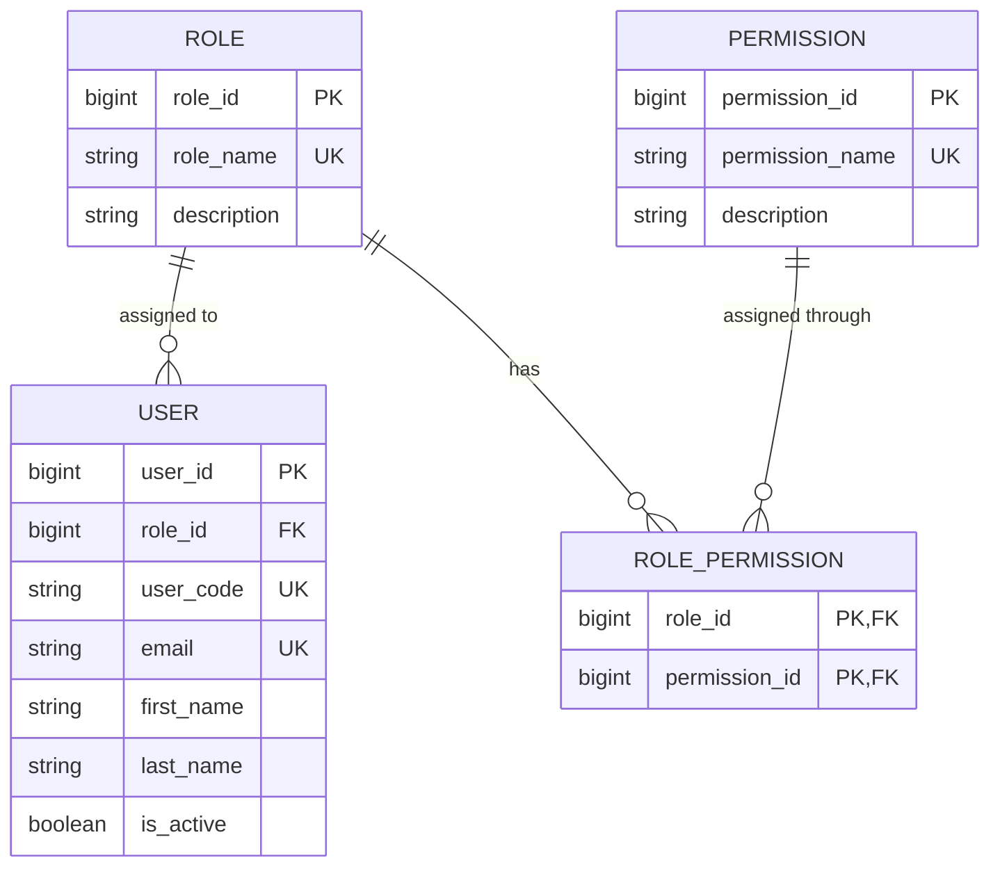
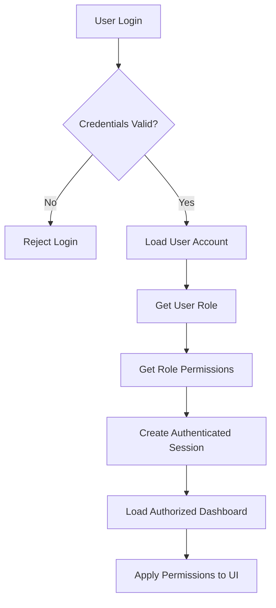
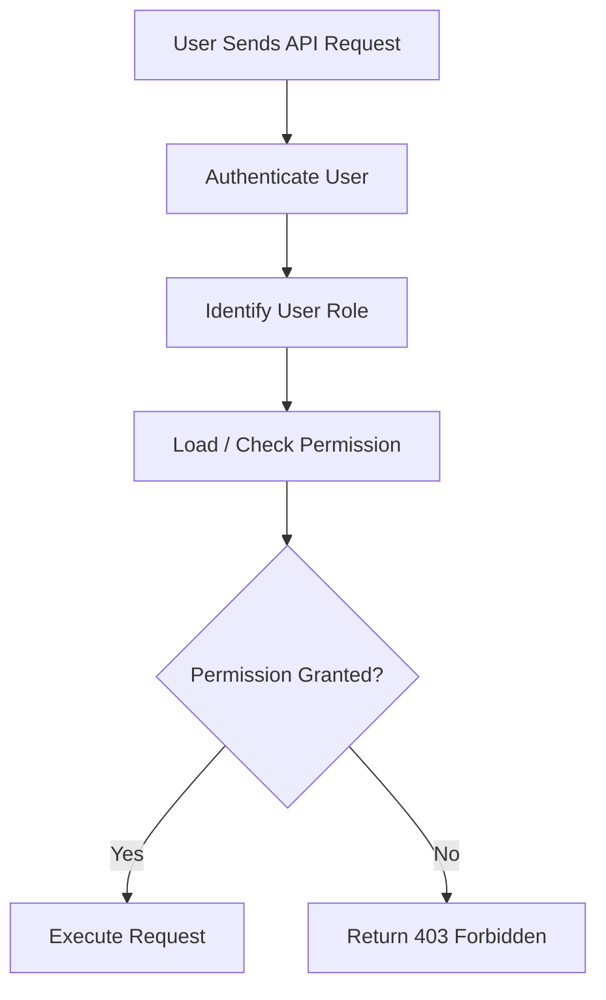

# Campus Equipment Borrowing & Reservation System
## Role-Based Permission Workflow

## 1. Overview

The system uses **role-based permissions** to control which dashboards, pages, and actions an account can access.

The authorization structure is:

```text
USER
  ↓
ROLE
  ↓
ROLE_PERMISSION
  ↓
PERMISSION
  ↓
Allow / Deny Action
```

### Core concept

- **User** — The account that logs into the system.
- **Role** — Defines the user's responsibility, such as Borrower, Custodian, or Administrator.
- **Permission** — Defines a specific capability or action the user is allowed to perform.
- **Role-Permission** — Connects a role to the permissions assigned to it.

---

# 2. Roles

The system has three primary roles:

| Role | Code | Description |
|---|---|---|
| Borrower | BRW | Users who browse equipment and submit reservation requests. |
| Custodian | CUS | Users who manage reservation requests and equipment release/return activities. |
| Administrator | ADM | Users who manage equipment, borrower profiles, users, roles, and permissions. |

---

# 3. Permission Matrix

The Role Permissions page presents permissions as a matrix.

A checked/filled box means the role has that capability.

| Capability | BRW | CUS | ADM |
|---|:---:|:---:|:---:|
| Browse catalog & calendar | ✓ | ✓ | ✓ |
| Submit reservation request | ✓ |  |  |
| Approve / reject request |  | ✓ | ✓ |
| Record release & return |  | ✓ | ✓ |
| Maintain equipment & categories |  |  | ✓ |
| Maintain borrower profiles |  |  | ✓ |
| Manage users & roles |  |  | ✓ |
| View borrowing history report |  | ✓ | ✓ |

The administrator can use this matrix to configure which capabilities are assigned to each role.

---

# 4. Database Structure

The permission system is represented by three main entities:



### Relationships

```text
USER
  │
  │ role_id
  ▼
ROLE
  │
  │ role_id
  ▼
ROLE_PERMISSION
  │
  │ permission_id
  ▼
PERMISSION
```

A user receives the permissions associated with their assigned role.

---

# 5. USER and ROLE

Each user has a `role_id` foreign key.

```text
USER
--------------------------------
user_id       PK
role_id       FK ────────┐
user_code     UK         │
email         UK         │
first_name               │
last_name                │
...                      │
                         ▼
                       ROLE
                  ----------------
                  role_id     PK
                  role_name
                  description
```

For example:

```text
Juan Dela Cruz
      │
      │ role_id = 1
      ▼
   Borrower
```

The `role_id` determines which set of permissions the user receives.

---

# 6. ROLE and PERMISSION

A role can have many permissions, and a permission can be assigned to multiple roles.

Therefore, this is a **many-to-many relationship**.

The `ROLE_PERMISSION` table acts as the junction table.

```text
ROLE
  │
  │ 1
  │
  │ M
  ▼
ROLE_PERMISSION
  ▲
  │ M
  │
  │ 1
PERMISSION
```

Example:

```text
BORROWER
 ├── Browse catalog & calendar
 └── Submit reservation request

CUSTODIAN
 ├── Browse catalog & calendar
 ├── Approve / reject request
 ├── Record release & return
 └── View borrowing history report

ADMINISTRATOR
 ├── Browse catalog & calendar
 ├── Approve / reject request
 ├── Record release & return
 ├── Maintain equipment & categories
 ├── Maintain borrower profiles
 ├── Manage users & roles
 └── View borrowing history report
```

---

# 7. Permission Records

Each capability can be stored as a permission record.

Recommended permission names:

| Permission | Description |
|---|---|
| `equipment.browse` | Browse equipment catalog and availability calendar. |
| `reservation.create` | Submit a reservation request. |
| `reservation.review` | Approve or reject reservation requests. |
| `transaction.release_return` | Record equipment release and return. |
| `equipment.manage` | Create, update, archive, and maintain equipment and categories. |
| `borrower.manage` | Maintain borrower profiles and eligibility. |
| `user_role.manage` | Manage users, roles, and role permissions. |
| `history.view` | View borrowing history and generate reports. |

The exact naming convention can be adjusted during implementation.

---

# 8. How the Administrator Configures Permissions

The administrator opens the **Role Permissions** page.

```text
Administrator Dashboard
        │
        ▼
Role & Permission Management
        │
        ▼
Select Role
        │
        ▼
Display Permission Matrix
        │
        ▼
Enable / Disable Permissions
        │
        ▼
Save Changes
```

For example, the administrator selects **Custodian**:

```text
Custodian Permissions

[x] Browse catalog & calendar
[x] Approve / reject request
[x] Record release & return
[x] View borrowing history report

[ ] Submit reservation request
[ ] Maintain equipment & categories
[ ] Maintain borrower profiles
[ ] Manage users & roles
```

When the administrator saves the changes, the system updates the `ROLE_PERMISSION` records.

---

# 9. What Happens When a User Logs In

The permission checking process begins after successful authentication.



Example:

```text
User
  │
  │ user_id = 101
  ▼
USER
  │
  │ role_id = 1
  ▼
ROLE
  │
  │ Borrower
  ▼
ROLE_PERMISSION
  │
  ├── equipment.browse
  └── reservation.create
```

The application now knows that this user can browse equipment and create reservations.

---

# 10. UI Permission Control

Permissions can be used to determine which menu items, buttons, pages, and actions are displayed.

For a Borrower:

```text
Borrower Dashboard

✓ Equipment Catalog
✓ Availability Calendar
✓ My Reservations
✓ Borrowing History

✗ Approve Reservation
✗ Release Equipment
✗ Manage Equipment
✗ Manage Users
✗ Manage Roles
```

For a Custodian:

```text
Custodian Dashboard

✓ Equipment Catalog
✓ Availability Calendar
✓ Reservation Requests
✓ Release & Return
✓ Borrowing History

✗ Manage Users
✗ Manage Roles
✗ Maintain Equipment
```

For an Administrator:

```text
Administrator Dashboard

✓ Equipment Catalog
✓ Availability Calendar
✓ Reservation Requests
✓ Release & Return
✓ Equipment Management
✓ Borrower Management
✓ User Management
✓ Role & Permission Management
✓ Borrowing Reports
```

---

# 11. Backend Authorization

UI restrictions alone are **not sufficient**.

The backend must also verify permissions whenever a protected API endpoint is accessed.



Example:

```text
POST /api/reservations/123/approve
```

The backend checks:

```text
Is the user authenticated?
        │
        ▼
What is the user's role?
        │
        ▼
Does the role have reservation.review?
        │
        ├── YES → Approve reservation
        │
        └── NO  → 403 Forbidden
```

This prevents users from bypassing the UI by directly calling protected endpoints.

---

# 12. Permission Lifecycle

The complete permission lifecycle is:

```text
1. Administrator creates/configures a role
              ↓
2. Administrator assigns permissions to the role
              ↓
3. User is assigned the role
              ↓
4. User logs in
              ↓
5. System identifies the user's role
              ↓
6. System determines the role's permissions
              ↓
7. UI displays permitted pages/actions
              ↓
8. User performs an action
              ↓
9. Backend checks the required permission
              ↓
10. Action is allowed or denied
```

---

# 13. Example: Approving a Reservation

Suppose a Custodian wants to approve a reservation.

```text
Custodian
    │
    ▼
Open Reservation Requests
    │
    ▼
Select Reservation
    │
    ▼
Click "Approve"
    │
    ▼
Backend receives request
    │
    ▼
Check authentication
    │
    ▼
Check user's role
    │
    ▼
Check reservation.review permission
    │
    ├───────────────┐
    │               │
   YES              NO
    │               │
    ▼               ▼
Approve          403 Forbidden
Reservation
```

The relevant permission is:

```text
reservation.review
```

The permission is assigned to:

```text
CUSTODIAN ✓
ADMINISTRATOR ✓
BORROWER ✗
```

---

# 14. Example: Managing Users

The **Manage Users & Roles** capability is restricted to administrators.

```text
Administrator
      │
      ▼
user_role.manage
      │
      ▼
Allowed
```

A Borrower attempting the same action:

```text
Borrower
    │
    ▼
user_role.manage
    │
    ▼
Permission not assigned
    │
    ▼
403 Forbidden
```

---

# 15. Important Design Principle

The system should follow **deny by default**.

```text
User requests action
        │
        ▼
Does user have required permission?
        │
   ┌────┴────┐
   │         │
  YES        NO
   │         │
   ▼         ▼
 ALLOW      DENY
            403
```

A user should only be able to perform an action when their role has explicitly been granted the corresponding permission.

---

# 16. Role Permission Architecture

The overall architecture can be summarized as:

```text
                     ┌───────────────┐
                     │     USER      │
                     └───────┬───────┘
                             │
                             │ role_id
                             ▼
                     ┌───────────────┐
                     │     ROLE      │
                     └───────┬───────┘
                             │
                             │
                             ▼
                  ┌────────────────────┐
                  │  ROLE_PERMISSION   │
                  └─────────┬──────────┘
                            │
                            │ permission_id
                            ▼
                     ┌───────────────┐
                     │  PERMISSION   │
                     └───────┬───────┘
                             │
                             ▼
                    Allowed Application
                       Action / Page
```

## Summary

The permission system follows this principle:

> **Users are assigned roles, roles are assigned permissions, and permissions determine which actions the user can perform.**

```text
USER
  ↓
ROLE
  ↓
ROLE_PERMISSION
  ↓
PERMISSION
  ↓
AUTHORIZATION
  ↓
ALLOW / DENY
```

The administrator controls the **role-to-permission assignments** through the Role Permissions UI, while the backend remains responsible for enforcing those permissions on protected operations.